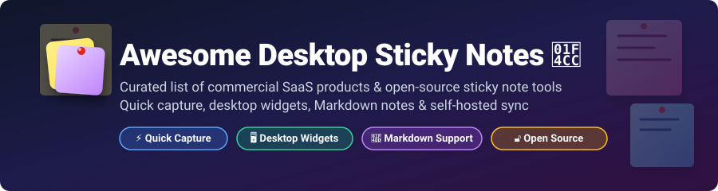

  

# 📌 Awesome Desktop Sticky Notes

  
  
  
  
  

**A curated directory of commercial SaaS sticky note applications and open-source desktop widget projects for quick capture, Markdown note-taking, and self-hosted synchronization.**

*Last updated: October 2026*

---

## 🔍 Overview & Key Features

This repository tracks notable **commercial SaaS apps** and production-ready **open-source projects** for **Desktop Sticky Notes**. These utility tools empower users to capture thoughts, reminders, code snippets, and to-do items instantly—keeping them permanently visible on the desktop canvas without the overhead of heavy productivity suites.

### 🌟 Why Desktop Sticky Notes?
- ⚡ **Instant Quick Capture**: Summon transparent or pinned note windows via global keyboard shortcuts (`Ctrl+Space`, `Win+Shift+N`).
- 📝 **Markdown & Rich Text**: Write formatted notes using GitHub Flavored Markdown (GFM), math expressions ($\text{\LaTeX}$), or rich media attachments.
- 🔄 **Privacy & Self-Hosting**: Store notes locally in SQLite/plain `.md` files or synchronize securely using self-hosted backend options.
- 🖥️ **Desktop Integration**: Keep floating sticky widgets pinned on Windows, macOS, or Linux desktop workspaces.

---

## 📖 Table of Contents

- [💼 Commercial SaaS Apps](#-commercial-saas-apps)
- [🔓 Open-Source GitHub Projects](#-open-source-github-projects)
- [🤝 How to Contribute](#-how-to-contribute)
- [💖 Support & Sponsorship](#-support--sponsorship)
- [📈 Star History](#-star-history)
- [⚠️ Disclaimer](#-disclaimer)

---

## 💼 Commercial SaaS Apps

> **📊 Market Context & Size**: The global note-taking and desktop productivity software market is estimated at **$7.5 Billion** (2026). The sticky notes sector within this market is **moderately fragmented**, balancing default OS-bundled utilities, general productivity suites, and specialized desktop widget software.

| App | Description | Pricing (Starting Tier) | Free Tier Limits | Company Size / Revenue / Valuation |
|:---|:---|:---|:---|:---|
| **[Google Keep](https://keep.google.com/)** 🟡 | **Google's note-taking app.** Color-coded notes, checklists, reminders, and cross-platform cloud sync across Android, iOS, and Web. | **Free** — included with Google Account. | **Unlimited** — 15GB shared Google Workspace account cloud storage limit. | **~$350B revenue** (Alphabet FY2025) |
| **[Microsoft Sticky Notes](https://www.microsoft.com/en-us/p/microsoft-sticky-notes/9nblggh4qghw)** 🟨 | **Default Windows desktop sticky notes utility.** Fast notes with basic text formatting, pen ink support, and cloud sync via Microsoft account. | **Free** — bundled with Microsoft Windows OS. | **Unlimited** — free with Windows. Cloud sync requires free Microsoft account. | **~$281B revenue** (Microsoft FY2025) |
| **[Post-it App](https://apps.apple.com/bh/app/post-it-app/id1475777828)** 🟧 | **Digitize physical Post-it Notes.** Capture photos of physical sticky notes, organize them on digital desktop boards, and export to PDF/Miro. | **$2.99/month** — Post-it Plus Premium plan for advanced export and cloud board syncing. | **Free tier**: Capture up to 200 physical Post-it notes per camera scan; organize on local digital boards. | **~$30B revenue** (3M Company FY2025) |
| **[Zoho Notebook](https://www.zoho.com/notebook/pricing.html)** 🟦 | **Cross-platform note app with rich media card views.** Syncs across desktop/mobile, supports audio/video recording, document scanning, and AI tools. | **$19.99/year** — Pro Plan subscription. | **Essential (Free)**: **500MB cloud storage**, max 10MB file upload size, 30-min audio recording per note, 20 note version histories. | **~$1B+ revenue** (Zoho Corp estimated) |
| **[Notezilla](https://www.softwareadvice.com/project-management/notezilla-profile/)** 🟩 | **Windows desktop sticky notes with sync and reminders.** Notes stick to specific application windows or websites, sync across devices, and set alarms. | **$14.95/year** — Notezilla Cloud Subscription (perpetual standalone license at $29.95). | **30-day free trial**: Full access to all desktop note features and cloud sync for 30 days. No perpetual free tier. | **Private** (Conceptworld Corporation) |
| **[Simple Sticky Notes](https://www.simplestickynotes.com/)** 🟪 | **Lightweight Windows desktop sticky notes app.** Fast, efficient, SQLite-backed. Supports checkboxes, custom themes, fonts, and portable mode. | **Free** — completely free software for personal and commercial usage. | **Unlimited** — 100% free with no feature restrictions, ads, or storage limits. | **Private** (Small independent developer) |

---

## 🔓 Open-Source GitHub Projects

Below is a collection of open-source sticky notes repositories and desktop note utilities, sorted by GitHub stargazers count (descending).

| Repo | Description | Stars |
|:---|:---|:---:|
| **[Notes (nuttyartist)](https://github.com/nuttyartist/notes)** 🟦 | **Fast and beautiful note-taking app written in C++.** Native Qt desktop app featuring **Markdown support**, folders, tags, **Kanban board view**, feed view, and customizable themes. Summon instantly via `Win+Shift+N`. Completely private with zero telemetry. **GPL-3.0** |  |
| **[Scratch](https://github.com/erictli/scratch)** 🟩 | **Minimalist, offline-first Markdown note-taking app.** **Notes stored as plain `.md` files on local disk**. WYSIWYG editing, Mermaid diagrams, KaTeX math rendering, wikilinks, slash commands, and focus mode. Integrates AI editing via local Ollama, Claude Code, or OpenAI. Git sync support. **MIT** |  |
| **[Floral Notepaper (花笺)](https://github.com/Achilng/floral-notepaper)** 🌸 | **Lightweight, elegant, modern local sticky notes widget.** Built with **Tauri 2 + React**. Features **Markdown live editing & preview** (GFM), **global hotkey summon** (`Ctrl+Space`), and **desktop tile mode** to pin notes on desktop. Supports `.md` import/export. Tray-resident & cross-platform. **MIT** |  |
| **[AnyNote](https://github.com/ychisbest/AnyNote)** 🟨 | **Open-source, self-hosted sticky notes web & desktop app.** **Cross-platform**, **WYSIWYG Markdown editor**, **real-time synchronization**, efficient full-text search, and AI features. Easily deployed via Docker backend: `docker run -d -p 8080:8080 -v /path/to/data:/data anynoteofficial/anynote:latest`. |  |
| **[Noted](https://github.com/fabriziosalmi/noted)** 🟪 | **Desktop app for Markdown/HTML notes with built-in AI.** **Wikilinks, backlinks, global search**, multi-provider AI (OpenAI, Anthropic, OpenRouter, **LM Studio, Ollama local**), Git integration, and **MCP server** for AI agent workflows. Local-first, zero telemetry. Built with Electron + React + TypeScript. **MIT** |  |
| **[stickynote (TUI)](https://github.com/Narqulie/stickynote)** 🟧 | **Terminal-based sticky notes board for CLI users.** Built with Rust (Ratatui + Crossterm). Supports **Markdown formatting, tagging, mouse interaction**, and stores notes in a local JSON file. Zero Electron overhead. Installable via `cargo install stickynote`. **MIT** |  |
| **[LiteNote (轻签)](https://github.com/SeaZhusp/LiteNote)** 🪟 | **Lightweight local to-do desktop widget.** Built with **Tauri 2 + React + SQLite**. Features **recurring to-dos** (daily/weekly/monthly), **deadline reminders** (15-min notifications), **weekly calendar view** with drag-to-assign, **transparent frosted-glass panel** with custom opacity, and global hotkey (`Ctrl+Shift+L`). **MIT** |  |
| **[web3stick/stickynotes](https://github.com/web3stick/stickynotes)** 🌐 | **Simple, offline-first sticky notes web application.** Stores notes in local storage JSON with custom card colors, pinned notes view, quick search, and no vendor lock-in. Ideal for lightweight browser tabs. |  |

---

### 🐧 Additional Linux & Open-Source Options

| Repo / Application | Platform / Ecosystem | Key Highlights |
|:---|:---|:---|
| **[Sticky Notes (Flathub)](https://flathub.org/apps/com.vinsent.StickyNotes)** | Linux / GNOME / Flatpak | Native GTK sticky notes application designed for Linux desktops. Pin colorful notes to desktop. |
| **[Jorts](https://flathub.org/apps/io.github.jorts)** | Linux / Flatpak | Lightweight desktop widget utility to write quick thoughts on colorful little sticky squares. |
| **[Notejot](https://flathub.org/apps/com.github.joseexposito.notejot)** | Linux / GTK | Elegant notebook and sticky note app designed for elementary OS and Linux desktops. |
| **[Iotas](https://flathub.org/apps/org.gnome.World.Iotas)** | Linux / GNOME | Simple, clean mobile and desktop note-taking app with Nextcloud sync support. |
| **[Folio](https://flathub.org/apps/dev.hbd.Folio)** | Linux / Flatpak | Beautiful Markdown note-taking desktop application with notebook organization and search. |

---

## 🤝 How to Contribute

Contributions are warmly welcomed! Help keep this directory updated and comprehensive.

1. 🍴 **Fork** this repository.
2. 📝 **Add or update** entries in `README.md` following the standard markdown table format.
3. 📌 Include the app name, direct link, 1–2 sentence detailed feature description, exact pricing/limits, and license.
4. 🚀 **Submit a Pull Request** with a brief summary of the added sticky note project.

---

## 💖 Support & Sponsorship

If you find this curated list of desktop sticky notes helpful, please consider supporting the project:

- ⭐ **Star this repository** to increase visibility on GitHub.
- 🔄 **Share** with developers, students, and productivity enthusiasts.
- ☕ **Sponsor / Buy me a coffee**: Support ongoing open-source maintenance via [GitHub Sponsors](https://github.com/sponsors/ishandutta2007).

Thank you for supporting open-source software and productivity tools! ❤️

---

## 📈 Star History

---

## ⚠️ Disclaimer

- This directory is a **community-curated list** for informational and educational purposes.
- Sticky notes applications handle personal, professional, and confidential information; always inspect data security, local encryption, and cloud sync policies before storing sensitive data.
- **Open-source landscape**: Open-source sticky note utilities offer high privacy, offline data ownership, custom GFM support, and local AI capabilities (via Ollama/LM Studio). Commercial SaaS apps provide multi-device cloud synchronization and OS-level integration. Select the tool that best fits your privacy and workflow requirements.
